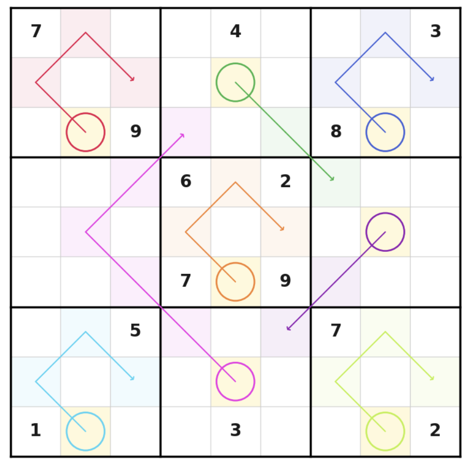
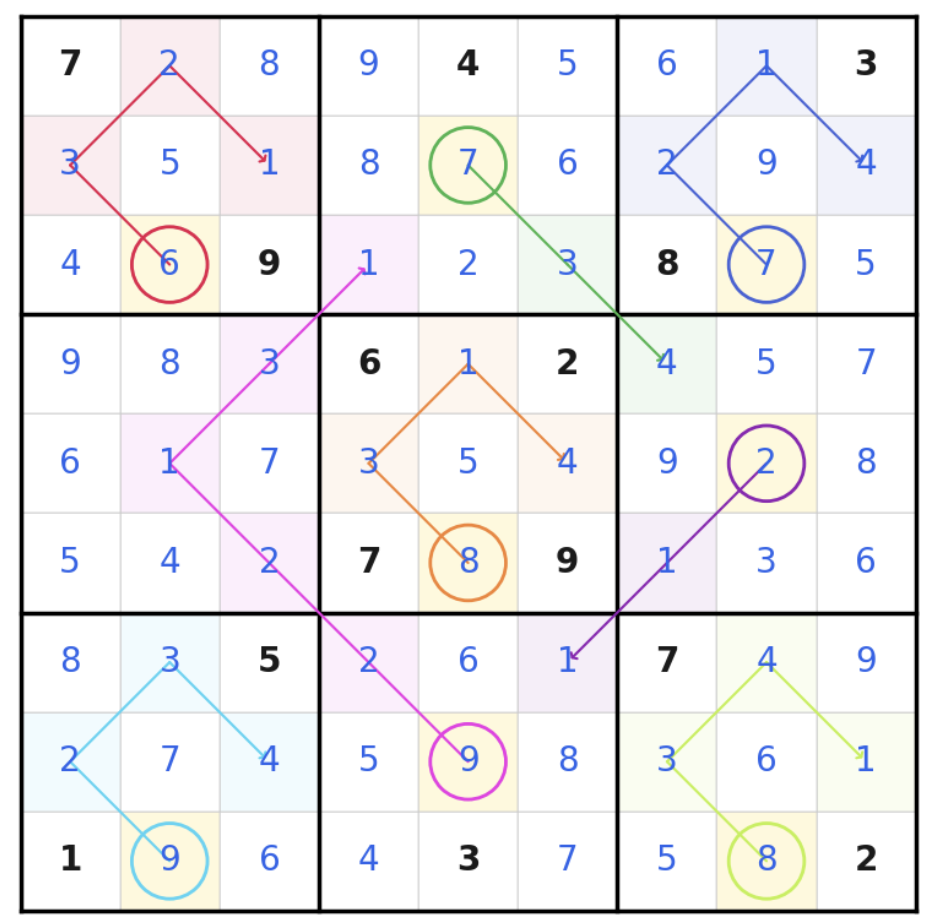
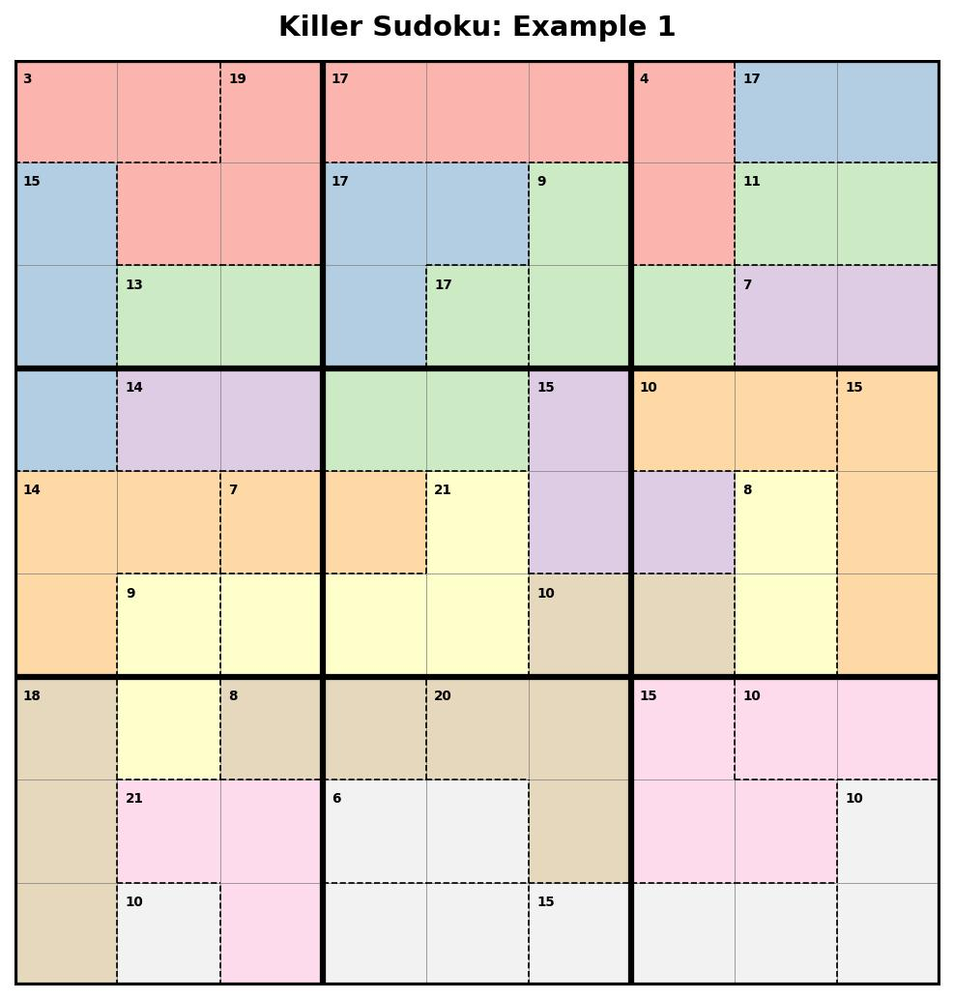
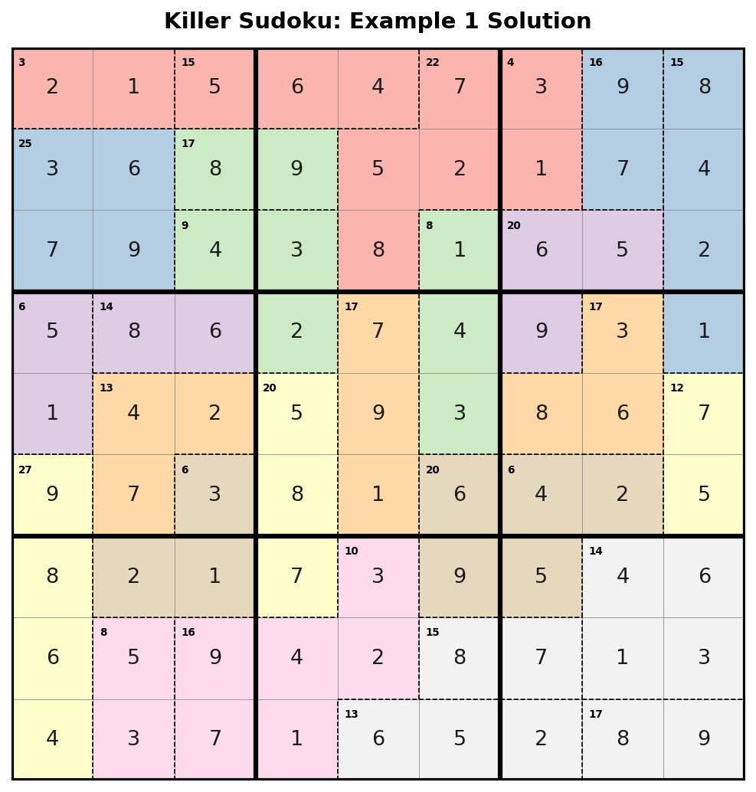
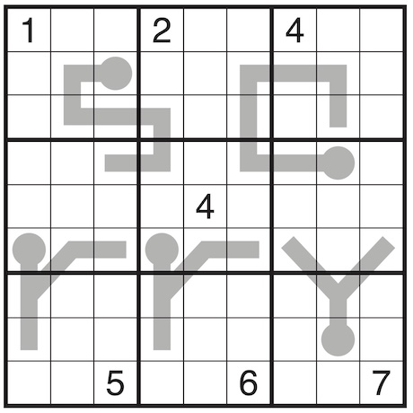
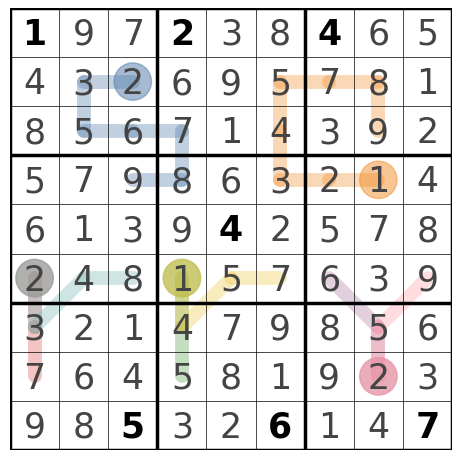

# Sudoku Solvers via Combinatorial Optimization

*Solving classic and variant Sudoku puzzles under different constraints.*

**Discrete Optimization Problems Project - 2025/26 W2, University of British Columbia**
Umay Gokturk · Tiffany Gong · Luna Kim

📄 **[Read the full report (PDF)](./Report.pdf)**

## Overview

Sudoku is a *feasibility* problem: there is nothing to maximize, only constraints to satisfy. We model every puzzle as a **Binary Integer Linear Program (BILP)** in Python with [PuLP](https://coin-or.github.io/pulp/), using one binary decision variable

$$G_{ijv} = 1 \text{ if cell } (i,j) \text{ holds digit } v \text{, else } 0$$

The classic rules (cell, row, column, and box uniqueness) become linear equalities. Each **variant just adds constraints** on top of that base.

## Contributions

  | Member | Part |
  | --- | --- |
  | Umay Gokturk | Arrow Sudoku |
  | Tiffany Gong | Killer Sudoku |
  | Luna Kim | Thermo Sudoku |

## Variants

### ➡️ Arrow Sudoku
The circled cell equals the **sum** of the digits along its arrow's path, one linear equality per arrow.

| Problem | Our result |
| :---: | :---: |
|  |  |

### 🧩 Killer Sudoku
The grid is partitioned into **cages**, each with a target sum and no repeated digit. Adds a cage-sum equality plus a per-cage uniqueness constraint.

| Problem | Our result |
| :---: | :---: |
|  |  |

### 🌡️ Thermo Sudoku
Digits along each **thermometer** must strictly increase from bulb to tip. Adds one inequality per adjacent pair on the thermometer.

| Problem | Our result |
| :---: | :---: |
|  |  |

## Results

Every variant solved to optimality. Most puzzles finish in well under a second (classic Sudoku averages ~0.048 s); runtime grows with difficulty, e.g. a *"Deadly"*-rated Killer took ~5.3 s versus ~0.65 s for an easier one.

## Repository

| Notebook | Variant |
| --- | --- |
| `Classic_Sudoku.ipynb` | Classic 9×9 |
| `Arrow_Sudoku.ipynb` | Arrow |
| `Killer_Sudoku.ipynb` | Killer |
| `Thermo_Sudoku.ipynb` | Thermo |

**Requirements:** Python 3.x · PuLP · NumPy · Matplotlib

## Reference

Core reference for the BILP formulation:

> F. Bukhari, S. Nurdiati, M. K. Najib, N. Safiqri. *Formulation of Sudoku puzzle using binary integer linear programming and its implementation in Julia, Python, and MiniZinc.* Jambura Journal of Mathematics, 4(2), 2022.

Puzzle examples are sourced from Grandmaster Puzzles, The Times, and Wikipedia - full credits in the [report](./Report.pdf).
